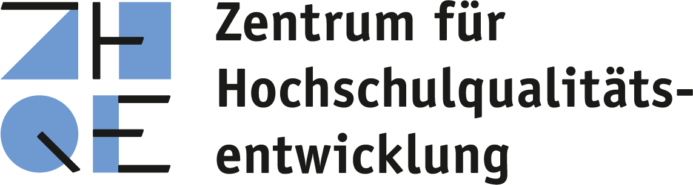
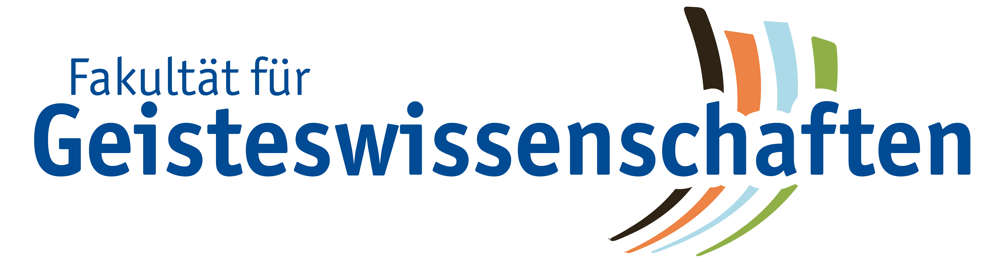

# Sentimentanalyse von Grimms Märchen mit Python

Ein interaktiver Selbstlernkurs, der Studierenden der Geistes- und Sozialwissenschaften die Grundlagen von Python beibringt — am Beispiel einer Sentimentanalyse von Grimms Märchen.

[](https://mybinder.org/v2/gh/Bayquiri/python-sentiment-grimm/main?labpath=00_Willkommen.ipynb)

---

## Über den Kurs

Dieser Kurs richtet sich an Studierende ohne Programmiererfahrung. In 11 interaktiven Jupyter Notebooks lernen Sie Python-Grundlagen und wenden diese direkt auf eine konkrete Forschungsfrage an: Wie ist die emotionale Stimmung in Grimms Märchen?

**Sie brauchen nichts zu installieren.** Der gesamte Kurs läuft im Browser.

### Kursstruktur

| Teil | Kapitel | Thema |
|------|---------|-------|
| **Teil 1** | 01–06 | Python-Grundlagen: Variablen, Strings, Listen, Texte einlesen und bereinigen, Schleifen, Bedingungen |
| **Teil 2** | 07–08 | Sentimentanalyse: Emotionale Wörter erkennen, Sentiment Score berechnen, Märchen vergleichen |
| **Teil 3** | 09–11 | Visualisierung, Abschlussprüfung und Bonus: Grenzen der Analyse (Ironie) |

Geschätzte Bearbeitungszeit: ca. 4–6 Stunden.

---

## Kurs nutzen

### Zum Ausprobieren (ohne Anmeldung)

Klicken Sie auf den Binder-Badge oben — die Umgebung wird automatisch aufgebaut. Das kann beim ersten Mal einige Minuten dauern.

### Über den JupyterHub (mit institutioneller Anmeldung, empfohlen)

Für die vollständige Kurserfahrung empfehlen wir die Nutzung über den NFDI JupyterHub. Im Gegensatz zu Binder bietet der Hub:

- **Fortschritt speichern** — Ihre Änderungen bleiben erhalten, auch wenn Sie die Sitzung beenden
- **Eigener Arbeitsbereich** — Jede/r Studierende bekommt eine persönliche Umgebung
- **Stabile Infrastruktur** — Gehostet auf der deNBI-Cloud, zuverlässig und performant

Die Anmeldung erfolgt über daphne4NFDI — Angehörige von Hochschulen und Forschungseinrichtungen können sich mit ihrer institutionellen Kennung einloggen.

[→ Kurs auf dem JupyterHub starten](https://hub.nfdi-jupyter.de/v2/git/https%3A%2F%2Fgit.uni-due.de%2Fadf929h%2Fsentimentanalyse_notebooks.git/main?labpath=00_Willkommen.ipynb&system=deNBI-Cloud&flavor=m1&localstoragepath=%2Fhome%2Fjovyan%2Fwork)

### Lokal auf dem eigenen Rechner

```bash
git clone https://github.com/Bayquiri/python-sentiment-grimm.git
cd python-sentiment-grimm
python -m venv venv
source venv/bin/activate  # Windows: venv\Scripts\activate
pip install -r requirements.txt
```

Anschließend können Sie die Notebooks in JupyterLab oder VS Code öffnen.

---

## Inhalt des Repositorys

```
├── Teil_1/                  Python-Grundlagen (Kapitel 01–06)
├── Teil_2/                  Sentimentanalyse (Kapitel 07–08)
├── Teil_3/                  Visualisierung und Abschluss (Kapitel 09–11)
├── maerchen_texte/          Märchentexte aus dem Deutschen Textarchiv
├── images/                  Abbildungen für den Kurs
├── logos/                   Logos der beteiligten Institutionen
├── kurs_helpers.py          Hilfsfunktionen, Sentiment-Lexikon, Stoppwortliste
├── requirements.txt         Python-Abhängigkeiten
├── cheatsheet_sentimentanalyse.pdf  Übersicht aller Kursbefehle
└── 00_Willkommen.ipynb      Einstiegsseite des Kurses
```

---

## Zitation

Sarah Ann Stock (2026): Sentimentanalyse von Grimms Märchen mit Python. Selbstlernkurs (Version 1.0). DOI: [https://doi.org/10.17185/duepublico/86519](https://doi.org/10.17185/duepublico/86519)

---

## Lizenz

Dieses Werk und dessen Inhalte sind – sofern nicht anders angegeben – lizenziert unter [CC BY-SA 4.0](https://creativecommons.org/licenses/by-sa/4.0/). Ausgenommen aus der Lizenz CC BY-SA 4.0 sind alle Logos.

Die Märchentexte stammen aus dem [Deutschen Textarchiv](https://www.deutschestextarchiv.de/) (Lizenz: [CC BY-SA 4.0](https://creativecommons.org/licenses/by-sa/4.0/)).

Die technische Umsetzung auf dem JupyterHub wurde im Rahmen des NFDI JupyterHub Incubator Projects auf der [deNBI-Cloud](https://hub.nfdi-jupyter.de/hub/home) realisiert.
This work is supported by Jupyter4NFDI as part of Base4NFDI (DFG project no.521453681).

---

## Projektzusammenhang

Dieser Kurs ist im Rahmen des von der Stiftung Innovation in der Hochschullehre von 2024–2026 geförderten Projekts „Digital Humanities Ruhr@UDE" entstanden. In dem gemeinsam von der Universitätsbibliothek (UB), dem Zentrum für Hochschulqualitätsentwicklung (ZHQE) und Mitarbeitenden aus dem Fach Germanistik der Fakultät für Geisteswissenschaften an der Universität Duisburg-Essen realisierten Projekt wurden zwei zentrale Lernangebote mit einem Schwerpunkt auf korpuslinguistische und texttechnologische Methoden der Digital Humanities entwickelt: der Basiskurs „Digitale Ressourcen und Methoden in der Linguistik" im Blended-Learning-Format als curriculares Pflichtmodul in den germanistischen Bachelorstudiengängen sowie fachübergreifend der Online-Selbstlernkurs „Discover Digital Humanities". Der hier veröffentlichte Kurs ist ein Teilmodul dieser Materialien.

Weitere Informationen zum Projekt, den Materialien und Ansprechpersonen finden Sie auf der Webseite [DH Ruhr@UDE](https://www.uni-due.de/ub/datacampus/dhruhr.php).

---

<p>

&nbsp;&nbsp;

&nbsp;&nbsp;

&nbsp;&nbsp;

&nbsp;&nbsp;

&nbsp;&nbsp;

</p>